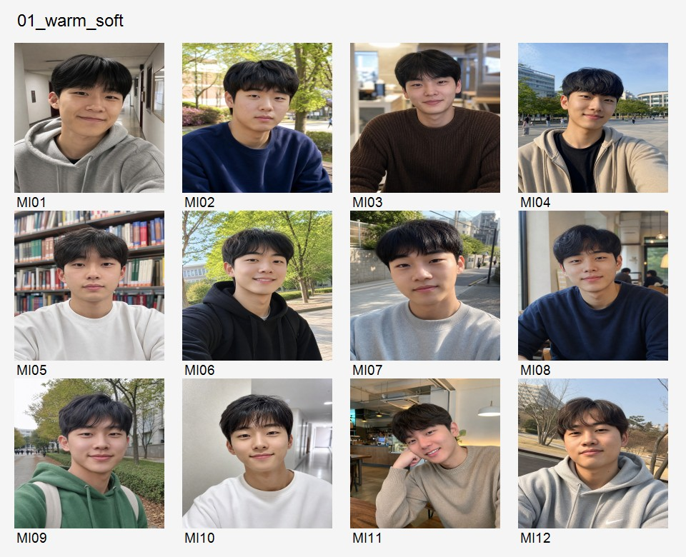
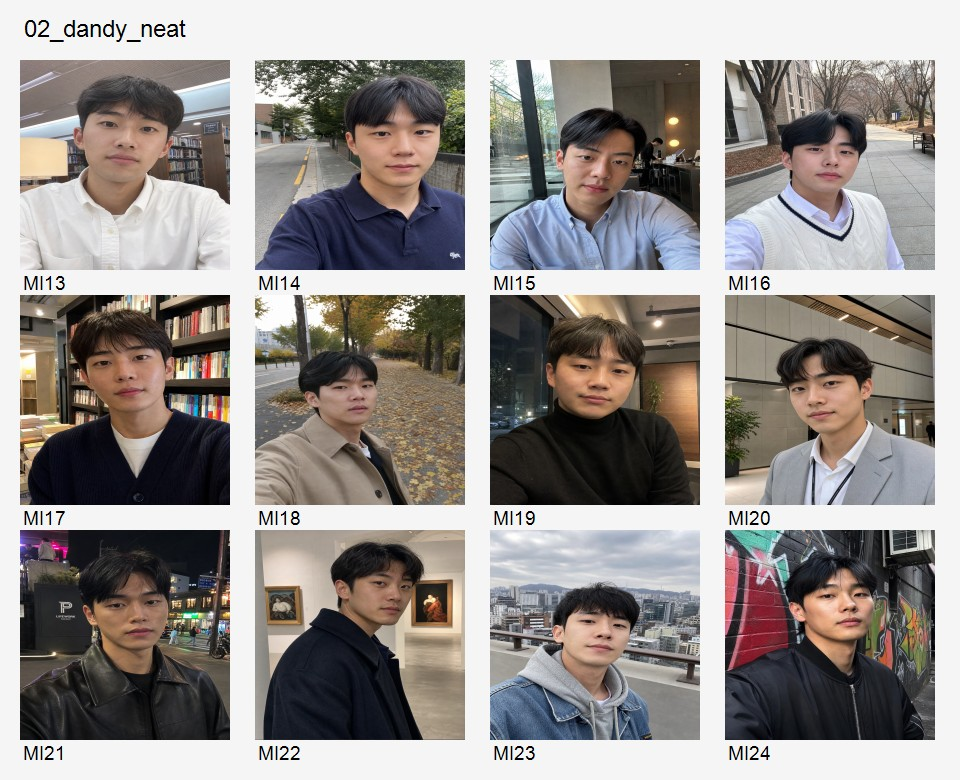
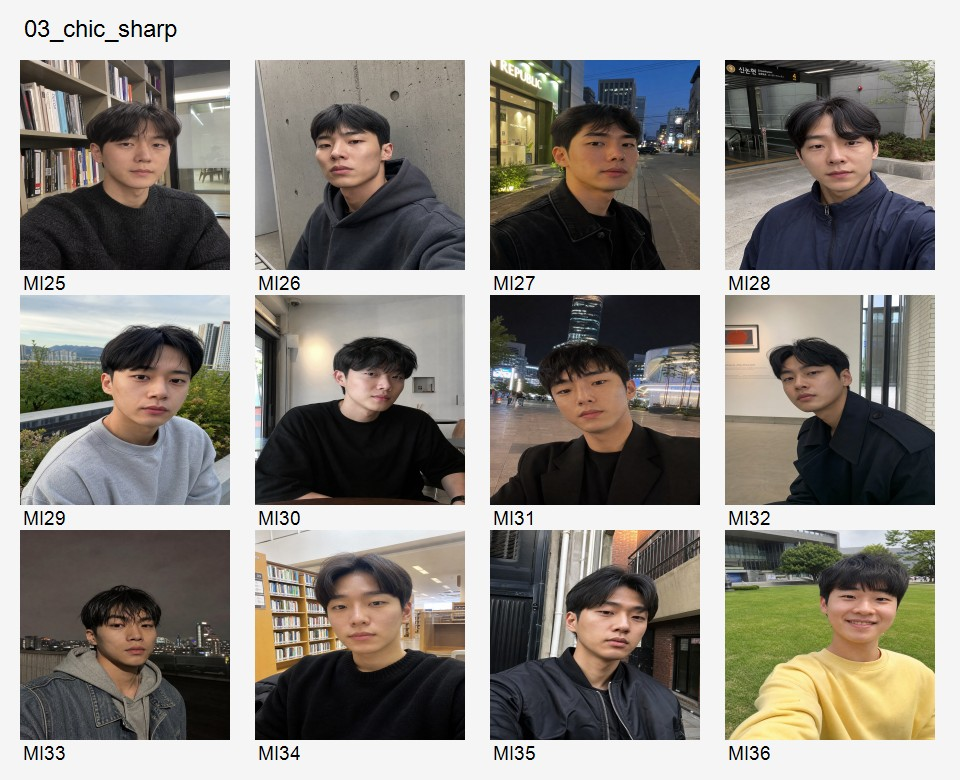
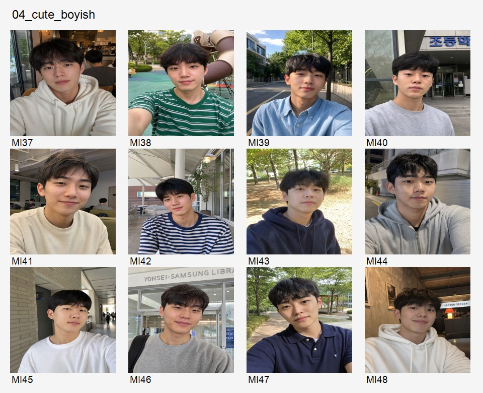
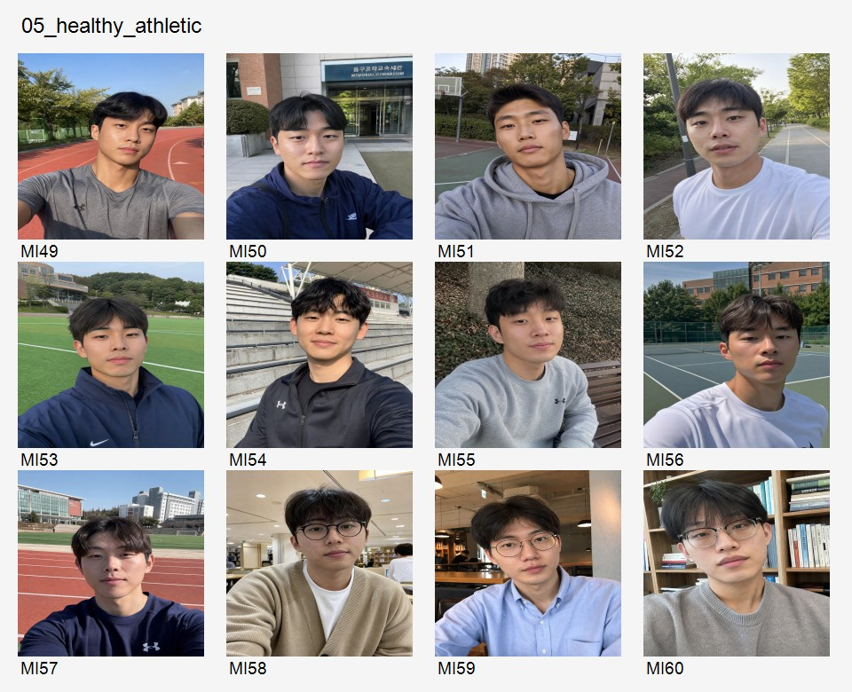
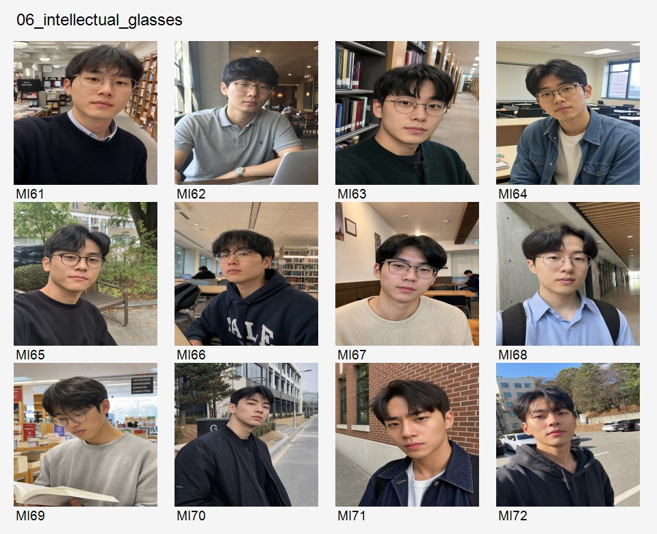
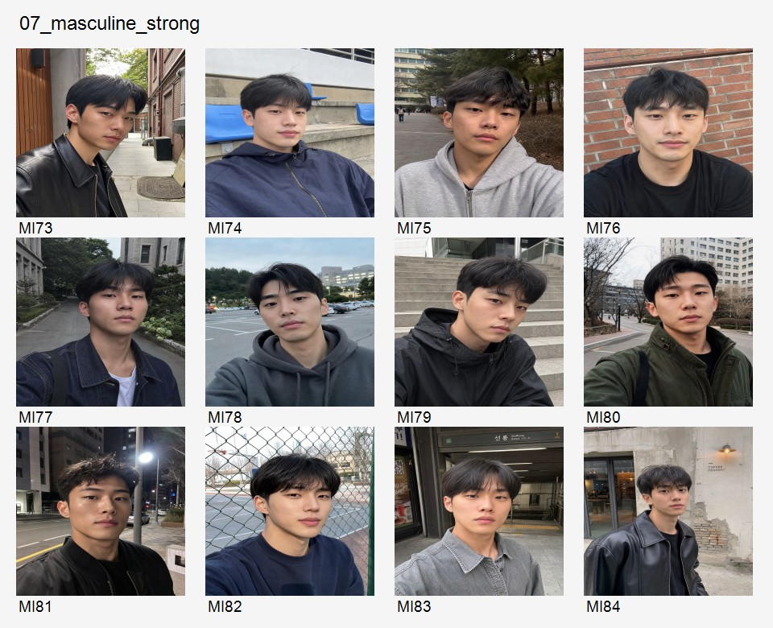
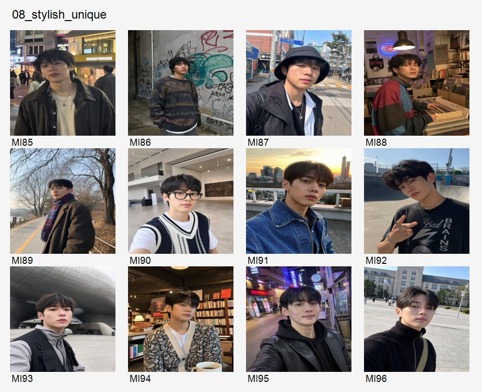

# Male Ideal Worldcup MI01-MI96 Codex Review - 2026-05-22

## 0. Source

- GitHub commit reviewed: `086a76a5c04e85f20d1238b72a9fdaf5dd007755`
- Commit title: `Feat: Generate 96 realistic male images for Ideal World Cup (MI01-MI96)`
- Remote branch observed: `origin/main`
- Added files in that commit:
  - `docs/MALE_IMAGES_METADATA_MI01_MI96.md`
  - `public/appearance-ideal/male-64/MI01.jpg` through `MI96.jpg`

Important: the commit adds images and a markdown metadata table only. It does **not** update `public/appearance-ideal/METADATA.json`. So the app will still not see these as the active measured male pool until a follow-up metadata merge is done.

## 1. Review Method

I extracted the remote commit into `.tmp/male-review` without merging it into the current working branch, then created type-level contact sheets for visual review.

This is a visual/product review, not a final GPT measured-vector pass. Scores below are Codex subjective first-pass judgments against the prompt:

- 20s male college/student or early-career look.
- Natural dating-app profile feel.
- No idol/model/influencer feel.
- Apparent score should stay at or below 77.
- Primary type should be visually legible.
- Final target is 64 images: 8 per type.

## 2. Contact Sheets

### 1. 훈훈/부드러운형, MI01-MI12

### 2. 댄디/단정형, MI13-MI24

### 3. 시크/날카로운형, MI25-MI36

### 4. 소년미/귀여운형, MI37-MI48

### 5. 운동/건강형, MI49-MI60

### 6. 지적/안경형, MI61-MI72

### 7. 강한 인상/남성미형, MI73-MI84

### 8. 스타일리시/개성형, MI85-MI96

## 3. High-Level Verdict

Manus completed the requested quantity correctly: 96 images, arranged MI01-MI96 in 8 blocks of 12.

The set is usable as a candidate pool, but not final as-is.

Main issues:

1. `METADATA.json` is not updated, so the app cannot use the male pool yet.
2. Several categories drift from their intended type.
3. A few images look above the intended 77-point ceiling.
4. A few images create age/minor-risk or background-risk.
5. Face/hair repetition is noticeable across the whole pool; the final 64 should prioritize diversity.

Best next step:

- Do not accept all 96.
- Use the recommended 64 below as the first final-pool candidate.
- Then run the same measured-vector/score process used for the female pool.
- Reject any measured `appearance_score_normalized > 77`.

## 4. Recommended Final 64 First Pass

These are the 64 I would carry forward before measured-vector scoring.

| Type | Recommended 8 |
| --- | --- |
| 훈훈/부드러운형 | MI01, MI03, MI04, MI05, MI06, MI08, MI09, MI11 |
| 댄디/단정형 | MI13, MI14, MI15, MI16, MI17, MI18, MI19, MI20 |
| 시크/날카로운형 | MI25, MI26, MI27, MI28, MI29, MI31, MI32, MI35 |
| 소년미/귀여운형 | MI37, MI38, MI39, MI41, MI42, MI43, MI44, MI48 |
| 운동/건강형 | MI49, MI50, MI51, MI52, MI53, MI55, MI56, MI57 |
| 지적/안경형 | MI61, MI62, MI63, MI64, MI66, MI67, MI68, MI69 |
| 강한 인상/남성미형 | MI73, MI75, MI76, MI78, MI79, MI80, MI81, MI84 |
| 스타일리시/개성형 | MI85, MI86, MI87, MI88, MI90, MI91, MI92, MI94 |

## 5. Exclusion List From First Pass

| Image ID | Reason |
| --- | --- |
| MI02 | Too neutral; weaker warm/soft signal than selected alternatives. |
| MI07 | Similar composition/face to nearby warm-soft candidates; close-up adds less type diversity. |
| MI10 | More polished/high-score risk than needed for this bucket. |
| MI12 | Lower type distinctiveness; duplicates hoodie/student signal already covered. |
| MI21 | Leather/night styling reads strong/chic more than dandy; score/high-intensity risk. |
| MI22 | Coat/profile pose reads too model-like for the dandy ceiling. |
| MI23 | Hoodie/denim rooftop reads casual soft, not dandy/neat. |
| MI24 | Graffiti/bomber styling reads street/chic, not dandy/neat. |
| MI30 | Too soft/neutral for sharp chic. |
| MI33 | Darker image; quality and face clarity weaker than selected chic set. |
| MI34 | Polished/high-score risk and less natural dating-app feel. |
| MI36 | Yellow sweatshirt and smile read warm/cute, not chic/sharp. |
| MI40 | Reject. Background appears to include an elementary-school sign and the subject reads too young. |
| MI45 | Low distinctiveness for boyish/cute compared with selected set. |
| MI46 | Reads general campus/soft rather than boyish/cute. |
| MI47 | More athletic/soft than cute; less useful after selected alternatives. |
| MI54 | High-score risk: "healthy handsome" may exceed intended ceiling. |
| MI58 | Category mismatch: glasses/library/intellectual, not athletic. |
| MI59 | Category mismatch: glasses/cafe/intellectual, not athletic. |
| MI60 | Category mismatch: glasses/library/intellectual, not athletic. |
| MI65 | Backup only; glasses present but weaker intellectual setting/signal than selected. |
| MI70 | Category mismatch: no clear glasses signal, reads chic/strong. |
| MI71 | Category mismatch: no clear glasses signal, reads chic/strong. |
| MI72 | Category mismatch: no clear glasses signal, reads chic/strong. |
| MI74 | Too soft/neutral for strong masculine bucket. |
| MI77 | Reads soft/ordinary rather than strong masculine. |
| MI82 | Tennis/campus styling reads soft/healthy rather than strong masculine. |
| MI83 | Neutral gray-shirt image; weak strong-masculine signal. |
| MI89 | High-fashion/high-score risk; could overpower type vector. |
| MI93 | Too posed/techwear; less natural dating-app feel. |
| MI95 | High-score / influencer-ish risk. |
| MI96 | More dandy/high-polish than distinct stylish/unique. |

## 6. Category-by-Category Review

### 6.1 훈훈/부드러운형

Manus intent is mostly appropriate. This category has the strongest prompt fit overall, but the faces and hairstyles repeat heavily.

| ID | Codex judgment |
| --- | --- |
| MI01 | Keep. Good natural soft profile. |
| MI02 | Drop. Too neutral, less type-specific. |
| MI03 | Keep. Soft and approachable. |
| MI04 | Keep. Warm campus selfie, usable. |
| MI05 | Keep. Library/white sweatshirt is natural and soft. |
| MI06 | Keep. Casual hoodie, good warmth. |
| MI07 | Drop. Too similar to other soft candidates. |
| MI08 | Keep. Cafe/sweater reads warm. |
| MI09 | Keep. Green hoodie and outdoor background add diversity. |
| MI10 | Drop. Higher polish/high-score risk. |
| MI11 | Keep. Cafe knit, strong warm signal. |
| MI12 | Drop. Duplicates hoodie/student signal. |

### 6.2 댄디/단정형

Mixed. MI13-MI20 mostly fit; MI21-MI24 drift into leather/street/casual.

| ID | Codex judgment |
| --- | --- |
| MI13 | Keep. White shirt/library reads neat. |
| MI14 | Keep. Polo and tidy hair are plausible dandy-lite. |
| MI15 | Keep. Shirt/cafe is clean and not too formal. |
| MI16 | Keep. Shirt vest is clear dandy signal. |
| MI17 | Keep. Cardigan/library, good daily neatness. |
| MI18 | Keep. Coat is borderline polished but still usable. |
| MI19 | Keep. Turtleneck/cafe, neat. |
| MI20 | Keep. Light suit styling, useful dandy signal. |
| MI21 | Drop. Leather/night reads strong/chic. |
| MI22 | Drop. Too model-like and high-score risk. |
| MI23 | Drop. Hoodie/denim is casual soft. |
| MI24 | Drop. Bomber/graffiti reads street/chic. |

### 6.3 시크/날카로운형

Generally usable. Need avoid overusing the most model-like entries.

| ID | Codex judgment |
| --- | --- |
| MI25 | Keep. Calm sharp look. |
| MI26 | Keep. Hoodie/concrete, chic enough. |
| MI27 | Keep. Black jacket/night street, strong signal. |
| MI28 | Keep. Navy jacket, realistic sharpness. |
| MI29 | Keep. Serious face, mild chic. |
| MI30 | Drop. Too soft/neutral. |
| MI31 | Keep. Night blazer, good chic signal, watch score. |
| MI32 | Keep. Dark coat/profile, good sharp signal. |
| MI33 | Drop. Darker/less clear. |
| MI34 | Drop. High polish and less natural feel. |
| MI35 | Keep. Leather/street, sharp. |
| MI36 | Drop. Yellow sweater and smile are warm/cute. |

### 6.4 소년미/귀여운형

Usable but one serious reject. MI40 should not be used because of the background and age impression.

| ID | Codex judgment |
| --- | --- |
| MI37 | Keep. Hoodie/cafe, cute but adult enough. |
| MI38 | Keep. Striped tee, fresh college feel. |
| MI39 | Keep. Blue shirt/campus, boyish. |
| MI40 | Reject. Elementary-school background and youthful impression. |
| MI41 | Keep. Soft smile, college cafe. |
| MI42 | Keep. Striped shirt, casual boyish. |
| MI43 | Keep. Hoodie/outdoor, useful. |
| MI44 | Keep. Hoodie/night, good cute signal. |
| MI45 | Drop. Weak type signal. |
| MI46 | Drop. Reads general warm/campus. |
| MI47 | Drop. Reads more athletic/soft. |
| MI48 | Keep. Hoodie/cafe, good cute candidate. |

### 6.5 운동/건강형

First nine mostly fit. Last three are clear category mismatches.

| ID | Codex judgment |
| --- | --- |
| MI49 | Keep. Track background, athletic. |
| MI50 | Keep. Sports jacket/campus, realistic. |
| MI51 | Keep. Hoodie/outdoor, athletic face/body. |
| MI52 | Keep. Running-path background, simple healthy. |
| MI53 | Keep. Field background, athletic. |
| MI54 | Drop. Strong high-score risk. |
| MI55 | Keep. Sporty sweatshirt/outdoor. |
| MI56 | Keep. Tennis court, good. |
| MI57 | Keep. Track/athletic shirt, good. |
| MI58 | Drop. Glasses/library, not athletic. |
| MI59 | Drop. Glasses/cafe, not athletic. |
| MI60 | Drop. Glasses/library, not athletic. |

### 6.6 지적/안경형

MI61-MI69 are strong enough. MI70-MI72 fail the "glasses" primary signal.

| ID | Codex judgment |
| --- | --- |
| MI61 | Keep. Glasses/library, clear. |
| MI62 | Keep. Glasses/laptop, clear. |
| MI63 | Keep. Glasses/bookshelf, clear. |
| MI64 | Keep. Glasses/classroom, clear. |
| MI65 | Drop/backup. Glasses present but weaker intellectual setting. |
| MI66 | Keep. Glasses/library hoodie, useful. |
| MI67 | Keep. Glasses/cafe, clear. |
| MI68 | Keep. Glasses/campus, clear. |
| MI69 | Keep. Reading/book, clear. |
| MI70 | Drop. No clear glasses signal; reads chic/strong. |
| MI71 | Drop. No clear glasses signal; reads chic/strong. |
| MI72 | Drop. No clear glasses signal; reads chic/strong. |

### 6.7 강한 인상/남성미형

Mixed. Some are strong enough, but several drift soft or athletic.

| ID | Codex judgment |
| --- | --- |
| MI73 | Keep. Leather jacket and sharp expression. |
| MI74 | Drop. Too soft/neutral. |
| MI75 | Keep. Stronger face and hoodie; usable. |
| MI76 | Keep. Black shirt and facial hair, clear adult signal. |
| MI77 | Drop. Too soft/ordinary. |
| MI78 | Keep. Stronger jaw/hoodie, usable. |
| MI79 | Keep. Sharp expression, good. |
| MI80 | Keep. Field jacket, good. |
| MI81 | Keep. Night jacket, strong enough. |
| MI82 | Drop. Tennis/campus reads soft/healthy. |
| MI83 | Drop. Neutral, weak strong signal. |
| MI84 | Keep. Leather jacket, clear. |

### 6.8 스타일리시/개성형

Good style diversity. Need remove the most fashion-influencer/high-score entries.

| ID | Codex judgment |
| --- | --- |
| MI85 | Keep. Street/vintage, clear. |
| MI86 | Keep. Beanie/graffiti, clear. |
| MI87 | Keep. Bucket hat/layering, clear. |
| MI88 | Keep. Record shop/color block, good. |
| MI89 | Drop. Too fashion/high-score leaning. |
| MI90 | Keep. Geek-chic, distinct. |
| MI91 | Keep. Denim, natural stylish. |
| MI92 | Keep. Graphic tee/accessories, clear. |
| MI93 | Drop. Too posed/techwear. |
| MI94 | Keep. Pattern cardigan/cafe, distinct. |
| MI95 | Drop. Influencer/high-score risk. |
| MI96 | Drop. Dandy/high-polish more than unique. |

## 7. Manus Metadata / Score Judgment

### What Manus got right

- File naming and block ordering match the prompt.
- The eight intended type buckets are present.
- Most expected score ranges are inside the requested 60-77 band.
- The set generally avoids explicit celebrity/idol styling.
- Most images look like plausible single-person dating app photos.

### What is not yet sufficient

Manus metadata is generation-intent metadata, not measured product metadata.

Missing for app integration:

- No `public/appearance-ideal/METADATA.json` update.
- No `measured.appearance_vector`.
- No `measured.appearance_score_normalized`.
- No `status: "active"` male final 64 selection.
- No `male_pool_mean_vector` / axis stats recomputation.

Score issue:

- The table repeatedly uses upper ranges `72-77` and `73-77`. That is acceptable as a target, but final selection must be measured because several images visually look near or above the ceiling.
- High-score risk images: MI10, MI21, MI22, MI31, MI34, MI54, MI62, MI89, MI95, MI96.
- I would not final-accept any of those without measured score confirmation below or equal to 77.

Type issue:

- Clear category mismatch images: MI23, MI24, MI36, MI58, MI59, MI60, MI70, MI71, MI72, MI82, MI83.
- Critical reject: MI40.

## 8. Required Follow-Up Before Product Use

1. Merge or cherry-pick commit `086a76a` into the active feature branch after current uncommitted work is handled.
2. Run a male image analysis pass equivalent to the female measured-vector process.
3. Write final selected 64 into `public/appearance-ideal/METADATA.json`.
4. Ensure every selected male item has:
   - `gender: "male"`
   - `status: "active"`
   - `file: "public/appearance-ideal/male-64/MIxx.jpg"`
   - `measured.appearance_score_normalized <= 77`
   - `measured.appearance_vector`
   - `review.decision` or equivalent final acceptance marker
5. Verify `selectActivePool(meta, 'male')` returns 64.
6. Run the ideal worldcup tests after metadata merge.

## 9. Final Recommendation

Do not ask Manus for a full regeneration yet.

This is good enough as a 96-image candidate pool. The correct next move is:

- Reject the obvious 32 listed above.
- Use the recommended 64 as first-pass final candidate.
- Run measured vector scoring.
- If measured score removes too many from a bucket, regenerate only that bucket.

Priority regeneration candidates if needed:

1. 운동/건강형 replacement for MI58-MI60.
2. 지적/안경형 replacement for MI70-MI72.
3. 소년미/귀여운형 replacement for MI40.
4. 댄디/단정형 replacement for MI21-MI24 if the selected 8 fail score checks.
