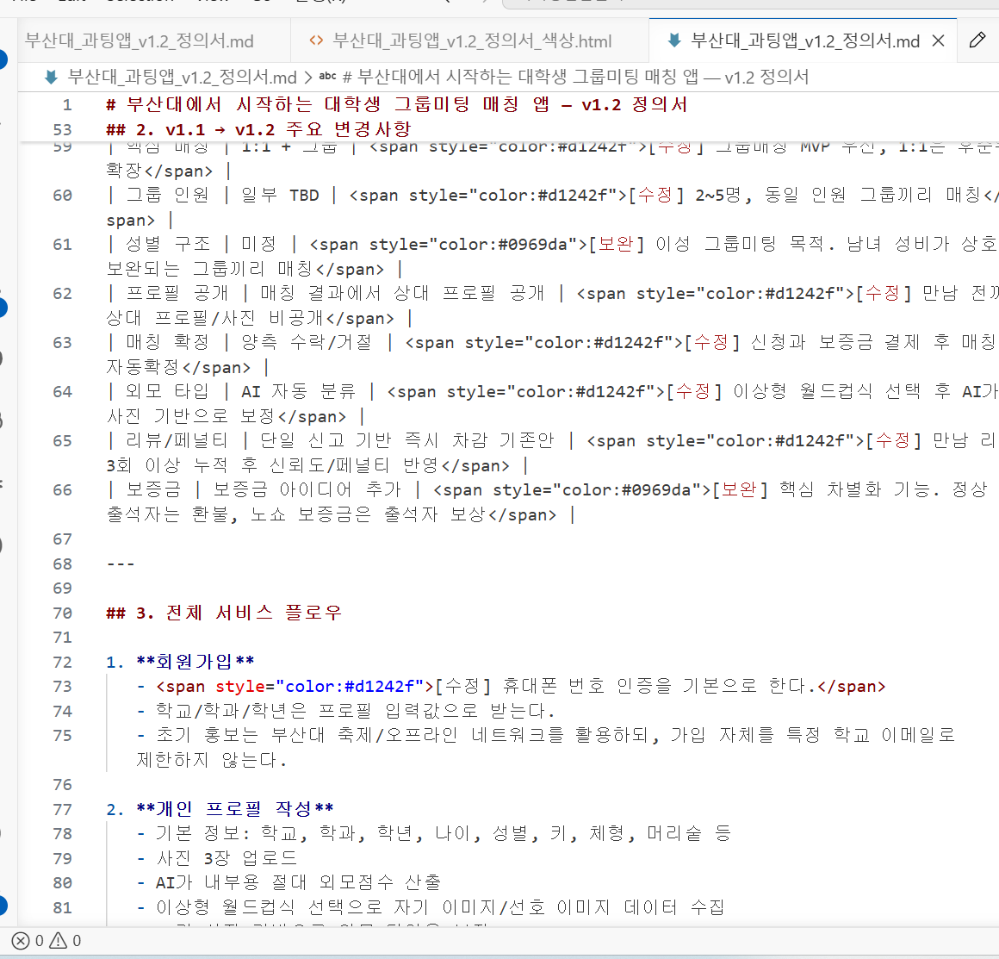

# 부산대에서 시작하는 대학생 그룹미팅 매칭 앱 — v1.2 정의서

> 색상으로 읽기 편한 버전: `부산대_과팅앱_v1.2_정의서_색상.html`

**작성일**: 2026-05-13 (최초) / 2026-05-14 (v1.2 보완)
**팀**:
- **김충현 (충현)** — v1.1/v1.2 정의서 작성 및 기획 주도
- **성준** — 팀원, v1.0 원안 작성자
**개발 도구**: Claude x 2 + Codex x 2 (각 팀원이 둘 다 보유, 총 4 LLM)
**프로젝트 기간**: 6주 (부산대 AI & ML 기말 팀 프로젝트)
**프로젝트 성격**: 학교 기말 프로젝트 + 부산대 축제/오프라인 홍보 기반 초기 실사용 + 추후 실서비스/수익화 가능성 염두

---

## 문서 편집 가이드

- 이 문서는 일반 마크다운 파일이므로 텍스트 에디터로 자유롭게 수정 가능
- [수정] 표시는 v1.1 내용에서 방향이 바뀐 핵심 변경 사항
- [보완] 표시는 v1.2에서 새로 추가된 보완 의견 또는 구현 주의 사항
- **TBD 또는 *(미확정)* 마커가 붙은 항목**은 결정 필요 항목
- 새로운 결정이 생기면 섹션 11 **미해결 항목**에서 제거하고 본문에 반영
- 큰 변경은 섹션 14 **변경 이력**에 한 줄 추가

---

## 0. 이 문서의 위치

- **v1.0**: 성준이 작성한 "시스템 동작 방식 정의서" (Big5 AI 인터뷰 기반)
- **v1.1**: AI 인터뷰 폐기 + 외모 자동 평가 + 보증금 시스템 도입
- **v1.2 (이 문서)**: [수정] 1:1 중심이 아니라 그룹미팅 중심으로 재정의
- **충돌 시 v1.2 우선**

---

## 1. 프로젝트 한 줄 정의

> **부산대에서 시작해 부산권 대학생으로 확장 가능한 그룹미팅 매칭 앱. 사용자가 친구들과 그룹을 만들고 보증금을 걸어 신청하면, 시스템이 상대 그룹·시간·장소를 자동으로 정해 실제 만남까지 성사시키는 "프로필 비공개 자동확정 과팅 앱".**

[수정] 서비스의 1차 홍보 거점은 부산대이지만, 서비스 대상을 부산대 학생으로만 제한하지 않는다.

[보완] 이 앱의 본질은 틴더/위피처럼 상대 프로필을 보고 선택하는 데이팅앱이 아니다. 사용자는 매칭 컴퓨터가 판단할 데이터를 제출하고, 앱은 그룹 단위로 실제 만남을 성사시키는 데 집중한다.

기존 데이팅앱과의 차별점:
- 프로필 쇼핑 X → 매칭 전후 상대 프로필/사진 비공개
- 채팅 단계 X → 매칭되면 바로 시간/장소 자동 확정
- 1:1보다 그룹미팅 우선 → 친구와 함께 신청해 접근성 상승
- 실제 소액 보증금 → 노쇼 방지와 서비스 신뢰 확보
- 외모 AI + 월드컵식 선택 → 사진 기반 객관 신호와 사용자 선호 신호를 함께 사용
- 만남 후 누적 리뷰 → 거짓말/노쇼/프로필 신뢰도 관리

---

## 2. v1.1 → v1.2 주요 변경사항

| 항목 | v1.1 | v1.2 |
|------|------|------|
| 서비스 범위 | 특정 학교 제한형 기존안 | [수정] 부산대에서 시작하지만 부산권 대학생으로 확장 가능 |
| 인증 | 학교 이메일 중심 기존안 | [수정] 휴대폰 인증 우선, 학교 정보는 프로필 입력값 |
| 핵심 매칭 | 1:1 + 그룹 | [수정] 그룹매칭 MVP 우선, 1:1은 후순위 확장 |
| 그룹 인원 | 일부 TBD | [수정] 2~5명, 동일 인원 그룹끼리 매칭 |
| 성별 구조 | 미정 | [보완] 이성 그룹미팅 목적. 남녀 성비가 상호 보완되는 그룹끼리 매칭 |
| 프로필 공개 | 매칭 결과에서 상대 프로필 공개 | [수정] 만남 전까지 상대 프로필/사진 비공개 |
| 매칭 확정 | 양측 수락/거절 | [수정] 신청과 보증금 결제 후 매칭되면 자동확정 |
| 외모 타입 | AI 자동 분류 | [수정] 이상형 월드컵식 선택 후 AI가 사진 기반으로 보정 |
| 리뷰/페널티 | 단일 신고 기반 즉시 차감 기존안 | [수정] 만남 리뷰 3회 이상 누적 후 신뢰도/페널티 반영 |
| 보증금 | 보증금 아이디어 추가 | [보완] 핵심 차별화 기능. 정상 출석자는 환불, 노쇼 보증금은 출석자 보상 |

---

## 3. 전체 서비스 플로우

1. **회원가입**
   - [수정] 휴대폰 번호 인증을 기본으로 한다.
   - 학교/학과/학년은 프로필 입력값으로 받는다.
   - 초기 홍보는 부산대 축제/오프라인 네트워크를 활용하되, 가입 자체를 특정 학교 이메일로 제한하지 않는다.

2. **개인 프로필 작성**
   - 기본 정보: 학교, 학과, 학년, 나이, 성별, 키, 체형, 머리숱 등
   - 사진 3장 업로드
   - AI가 내부용 절대 외모점수 산출
   - 이상형 월드컵식 선택으로 자기 이미지/선호 이미지 데이터 수집
   - AI가 사진 기반으로 외모 타입을 보정
   - 성격 설문 작성
   - 가능 시간대 입력

3. **그룹 생성**
   - 사용자는 2~5명 그룹을 만든다.
   - 친구 초대 링크 또는 초대코드로 멤버를 모은다.
   - 모든 멤버가 프로필, 사진, 설문, 가능 시간대 입력을 완료해야 매칭 신청 가능

4. **보증금 결제 후 그룹매칭 신청**
   - [수정] 그룹이 매칭 풀에 들어가기 전 각 멤버가 소액 보증금을 결제한다.
   - 신청 후에는 매칭 결과에 대한 수락/거절 없이 자동확정되는 것에 동의한다.

5. **주 1회 배치 그룹매칭**
   - 같은 인원 수 그룹끼리만 매칭한다.
   - 남녀 성비가 상호 보완되는 그룹끼리 매칭한다.
   - 예: 남3 ↔ 여3, 남1여2 ↔ 남2여1
   - 그룹 단위 양방향 점수와 조화평균을 사용해 최적 조합을 산출한다.

6. **자동확정**
   - [수정] 매칭이 성사되면 상대 프로필을 보여주고 수락받는 단계 없이, 시스템이 바로 시간/장소를 확정한다.
   - 만남 전까지 상대의 사진/상세 프로필은 공개하지 않는다.
   - 앱은 "몇 명 대 몇 명", "장소", "시간", "주의사항"만 제공한다.

7. **만남 진행**
   - 만남 장소는 부산대/부산권 대학가 근처 카페, 술집, 식당 등에서 선택
   - 초기 프로젝트에서는 관리자 큐레이션 장소 DB를 사용
   - 실서비스에서는 지역별 장소 DB로 확장

8. **출석 인증 및 보증금 처리**
   - GPS 체크인 + 그룹 상호 인증을 기본 출석 검증 방식으로 사용
   - 정상 출석자는 보증금 환불
   - 노쇼자의 보증금은 출석자 보상 재원으로 사용

9. **만남 후 리뷰**
   - 각 멤버는 만남 1회마다 상대방에 대한 간단한 리뷰를 남긴다.
   - 리뷰는 즉시 페널티가 아니라 누적 신뢰도 계산에 사용한다.
   - 동일 항목 리뷰가 3회 이상 쌓인 뒤부터 프로필 신뢰도/거짓말 페널티에 반영한다.

10. **호감 연결**
    - 만남 후 서로 호감 표시가 일치한 사람끼리만 앱 내 연결 생성
    - 연결 후에만 1:1 채팅 또는 연락처 교환 기능 제공

---

## 4. 매칭 시스템 상세

### 4.1 프로필의 의미

[수정] 프로필은 상대방에게 보여주는 소개장이 아니라, 매칭 엔진에 제출하는 비공개 데이터다.

프로필 데이터의 용도:
- 그룹 간 매칭 점수 계산
- 그룹 내부 균형도 계산
- 시간/장소 자동 배정
- 노쇼/거짓말/리뷰 신뢰도 관리
- 만남 후 연결 추천

사용자에게 공개하지 않는 정보:
- 절대 외모점수
- AI가 산출한 세부 점수
- 매칭 전 상대 사진
- 매칭 전 상대 상세 프로필
- 매칭 점수 산식의 개별 결과

### 4.2 외모 점수

**1단 — 절대점수 (AI 내부 산출)**
- 모델 후보: SCUT-FBP5500 + ResNet50
- 사용자 사진 3장 평균으로 내부용 0~100 점수 산출
- [수정] 절대 외모점수는 사용자에게 공개하지 않는다.
- 사용자 화면에는 "사진 평가 완료", "다음 매칭부터 반영" 같은 상태만 표시한다.

**사진 업데이트와 재평가**
- 사용자는 사진을 업데이트할 수 있다.
- 사진 업데이트 시 AI가 외모점수와 외모 타입을 재평가한다.
- 새 점수는 다음 매칭부터 반영한다.
- 점수 숫자와 상승/하락 폭은 공개하지 않는다.
- 큰 변동이 감지되면 운영자 검토 플래그를 둘 수 있다.

### 4.3 외모 타입: 월드컵 판정 후 AI 보정

[수정] 외모 타입은 사용자가 마음대로 직접 고르는 방식도 아니고, AI가 단독으로 판정하는 방식도 아니다.

절차:
1. 사용자는 이상형 월드컵처럼 2개 이미지 중 더 가깝다고 느끼는 이미지를 반복 선택한다.
2. 월드컵은 두 종류로 나눈다.
   - 자기 이미지 월드컵: "나는 어느 쪽 이미지에 더 가까운가"
   - 선호 이미지 월드컵: "나는 어느 쪽 이미지가 더 끌리는가"
3. AI는 업로드 사진을 보고 외모 타입 후보를 산출한다.
4. 시스템은 월드컵 결과와 AI 결과를 비교한다.
5. 자기 선택이 사진 기반 신호와 크게 다르면 AI 보정값을 반영한다.

외모 타입 예시:
- 귀여움
- 청순
- 시크
- 훈훈
- 스타일리시
- 건강함

[보완] 자기 외모를 유리하게 선택하는 문제를 줄이기 위해, 자기 이미지 월드컵 결과는 그대로 확정값으로 쓰지 않고 AI 보정 대상으로 둔다. 반대로 선호 이미지 월드컵은 사용자의 취향이므로 그대로 중요한 매칭 신호로 사용한다.

### 4.4 성격 점수

- AI 인터뷰는 사용하지 않는다.
- 고정 설문 기반으로 성격 데이터를 수집한다.
- 후보: IPIP-NEO 단축형 50문항 한국어판
- 빅5 5차원 점수로 변환한다.
- LLM API 기반 분석은 v1.2 핵심 기능에서 제외한다.

### 4.5 가중치 시스템

사용자는 매칭에서 중요한 요소를 직접 분배한다.

항목 후보:
- 외모
- 성격
- 키
- 체형
- 학교/학과
- 취미/분위기
- 시간대 적합성

[보완] 그룹매칭에서는 개인 가중치뿐 아니라 그룹 평균 가중치도 함께 계산한다. 예를 들어 한 그룹 전체가 외모를 매우 중요하게 보면 상대 그룹 평가에서 외모 비중이 커진다.

### 4.6 그룹매칭 알고리즘

**기본 원칙**
- 그룹매칭이 MVP의 1순위다.
- 그룹 인원은 2~5명이다.
- 동일 인원 그룹끼리만 매칭한다.
- 성비가 상호 보완되는 그룹끼리만 후보가 된다.

성비 매칭 예시:
- 남2 ↔ 여2
- 남3 ↔ 여3
- 남1여1 ↔ 남1여1
- 남1여2 ↔ 남2여1
- 남2여3 ↔ 남3여2

**Step 1 — 후보 필터링**
- 인원 수 동일
- 성비 상호 보완
- 가능 시간대 교집합 존재
- 이전에 만남이 성사된 그룹/개인 조합 제외
- 보증금 결제 완료

**Step 2 — 개인 간 점수 계산**
- A그룹의 각 멤버가 B그룹의 각 멤버를 평가하는 점수 계산
- B그룹의 각 멤버가 A그룹의 각 멤버를 평가하는 점수 계산
- 각 사용자의 가중치와 선호를 반영

**Step 3 — 그룹 간 점수 계산**
- A그룹 → B그룹 평균 점수
- B그룹 → A그룹 평균 점수
- 두 값을 조화평균으로 결합

공식:
`2 x (A그룹→B그룹) x (B그룹→A그룹) / ((A그룹→B그룹) + (B그룹→A그룹))`

**Step 4 — 그룹 내부 불균형 페널티**
- 한 명만 지나치게 손해 보는 매칭을 줄이기 위해 개인 최저점이 너무 낮으면 감점
- 그룹 내 외모점수 최고-최저 차이는 하드 차단보다 감점 요소로 사용
- [보완] 가변 인원 그룹에서는 "평균은 높지만 특정 멤버가 완전히 소외되는 매칭"을 막는 것이 중요하다.

**Step 5 — 최적 매칭**
- 같은 인원/성비 후보군별로 헝가리안 알고리즘 적용
- 목표는 전체 그룹 매칭 만족도 합계 최대화

### 4.7 1:1 매칭

[수정] 1:1 매칭은 MVP 우선순위에서 제외하고, 그룹매칭 이후 확장 기능으로 둔다.

후순위 기능으로 남기는 이유:
- 초기 사용자 접근성은 친구와 함께 신청하는 그룹미팅이 더 높다.
- 보증금/노쇼 방지의 설득력도 그룹 단위에서 더 강하다.
- 앱의 정체성이 일반 데이팅앱으로 보이는 것을 줄일 수 있다.

---

## 5. 안전/페널티/리뷰 시스템

### 5.1 누적 리뷰 기반 프로필 신뢰도

[수정] 신고 1회로 즉시 점수를 차감하지 않는다.

리뷰 구조:
- 만남 1회마다 상대방 리뷰 가능
- 리뷰 대상은 외모 점수 자체가 아니라 프로필 정보의 정확도와 만남 태도
- 예: 키, 체형, 머리숱, 사진과 실물 차이, 노쇼, 지각, 불쾌한 태도

반영 원칙:
- 동일 사용자에 대한 리뷰가 3회 이상 쌓이기 전까지 자동 페널티 없음
- 다수 리뷰가 같은 항목을 지적하면 프로필 신뢰도 하락
- 소수 의견이 다수 의견과 크게 다르면 신고자 신뢰도 하락
- 운영자는 고위험 신고만 수동 검토

예시:
- A가 3번 만남
- 상대 1은 "탈모 있음" 리뷰
- 상대 2, 3은 "탈모 없음" 리뷰
- 결과: A의 점수 차감 없음, 상대 1의 리뷰 신뢰도 하락 가능

### 5.2 노쇼 페널티

- 보증금 몰수 또는 보상 이전
- 노쇼 횟수 누적 시 N주 매칭 제한
- 반복 노쇼 사용자는 영구 제한 가능
- 거짓 출석 인증 적발 시 강한 페널티 적용

### 5.3 이전 만남 차단

- 한 번 만남이 성사된 개인 조합은 `excluded_pairs`에 기록한다.
- 같은 두 사람이 다시 매칭되지 않도록 한다.
- 그룹 단위에서도 이전 그룹 조합을 기록한다.
- 단, 그룹 멤버가 일부 바뀐 경우는 개인 단위 제외 규칙을 우선 적용한다.

---

## 6. 보증금 시스템

보증금은 v1.2의 핵심 차별화 기능이다.

[보완] 보증금이 없으면 사용자는 "또 하나의 데이팅앱 장사"로 받아들일 수 있다. 이 앱은 보증금을 통해 노쇼를 줄이고, 실제 만남을 보장하려는 서비스라는 인상을 줘야 한다.

### 6.1 기본 메커니즘

- 그룹매칭 신청 시 각 멤버가 실제 소액 보증금을 결제한다.
- 매칭이 성사되면 별도 수락 없이 자동확정된다.
- 정상 출석자는 보증금을 환불받는다.
- 노쇼자는 보증금을 돌려받지 못한다.
- [수정] 노쇼자의 보증금은 출석자에게 보상되는 것을 목표 구조로 한다.

### 6.2 금액

- 초기 후보: 1,000원~5,000원
- 실서비스 후보: 5,000원~20,000원
- v1.2 권장: 학교 프로젝트/초기 검증 단계에서는 3,000원 수준의 소액 모델로 설명

[보완] 금액이 너무 크면 진입장벽과 법적/분쟁 리스크가 커지고, 너무 작으면 노쇼 방지 효과가 약해진다. 초기에는 "부담은 작지만 장난 신청은 막는 금액"이 적합하다.

### 6.3 출석 검증

기본 조합:
- GPS 체크인
- 그룹 상호 인증

출석 인정 조건:
- 약속 시간 전후 일정 범위 안에 장소 반경 내 체크인
- 상대 그룹이 실제 만남을 확인
- 그룹 단위로 과반 이상 출석 확인

보완 검증:
- 제휴 장소 QR 인증 *(후순위)*
- 운영자 수동 검토 *(분쟁 시)*
- 사진 인증 *(사생활 이슈가 있어 기본값으로 두지 않음)*

### 6.4 결제/환불/보상 구현 단계

**학교 프로젝트 단계**
- 실제 돈 이동 없이 DB 상태 또는 PG 테스트 결제로 플로우 구현
- 결제 상태: `paid`, `refunded`, `forfeited`, `compensated`
- 출석 검증 후 보증금 처리 시나리오를 화면과 DB로 증명

**초기 실서비스 단계**
- PG 결제 사용
- 정상 출석자는 결제 취소/부분 취소로 환불
- 노쇼자는 미환불 처리
- 출석자 보상은 수동 정산 또는 쿠폰/무료매칭권으로 시작 가능

**확장 단계**
- PG 지급대행 또는 별도 정산 API 검토
- 출석자에게 자동 보상금 지급
- 사용자 본인확인, 계좌정보, 정산 로그, 분쟁 처리 정책 필요

참고:
- 토스페이먼츠 결제 취소/부분 취소: https://docs.tosspayments.com/guides/v2/cancel-payment
- 토스페이먼츠 지급대행: https://docs.tosspayments.com/guides/v2/payouts

[보완] 지급대행은 기술적으로 가능하지만 별도 계약, 본인확인, 정산 책임이 붙는다. v1.2에서는 "서비스 목표 구조"와 "학교 프로젝트 구현 방식"을 분리한다.

### 6.5 수익 모델

기본 수익 후보:
- 노쇼 보증금 일부 운영비 귀속 *(단, 사용자 반감 가능)*
- 정상 만남 후 자율 수고비
- 프리미엄 매칭권
- 장소 제휴 수수료

v1.2 권장:
- 초기에는 "노쇼 방지"를 전면에 내세우고, 수익화는 후순위로 둔다.
- 사용자에게는 "돈을 벌려고 만든 앱"보다 "노쇼 없는 과팅을 만들기 위한 보증금"으로 설명한다.

---

## 7. 호감 연결

- 만남 후 각 사용자는 상대 그룹 멤버 중 호감 있는 사람을 선택할 수 있다.
- 서로 선택이 일치하면 `connections` 테이블에 연결을 생성한다.
- 연결 후에만 1:1 채팅 또는 연락처 교환 기능 제공
- 연결되지 않은 사용자끼리는 앱 내 대화 불가

[보완] 이 구조는 만남 전 프로필 쇼핑과 채팅 피로를 줄이면서, 실제 만남 후 호감이 생긴 사람만 연결되게 한다.

---

## 8. 외모 AI 기술 스택

### 8.1 절대 외모점수 산출

- SCUT-FBP5500 + ResNet50 후보
- Python + PyTorch로 추론
- 사진 3장 평균 → 내부 점수화
- 점수는 절대 공개하지 않음
- 매칭 엔진 입력값으로만 사용

### 8.2 월드컵 + AI 보정형 외모 타입

구성:
- 프론트엔드: 이상형 월드컵 UI
- 백엔드: 월드컵 선택 로그 저장
- AI 서버: 사진 기반 타입 후보 산출
- 매칭 엔진: 월드컵 결과와 AI 보정값을 결합

결합 방식:
- 자기 이미지: 사용자 선택 40%, AI 사진 보정 60%
- 선호 이미지: 사용자 선택 80%, 시스템 보정 20%

[보완] 자기 이미지에는 과장 가능성이 있으므로 AI 비중을 높이고, 선호 이미지는 주관 취향이므로 사용자 선택 비중을 높인다.

### 8.3 LLM API 사용 여부

[수정] LLM API는 v1.2 핵심 기능에서 제외한다.

이유:
- 비용 발생
- 결과 재현성 낮음
- 학교 프로젝트의 핵심 기술 설명이 흐려짐
- 고정 설문/수식/오픈소스 CV 모델로 충분히 구현 가능

---

## 9. 전체 기술 스택

| 영역 | 기술 | 비고 |
|------|------|------|
| Frontend | Next.js 14 | 웹앱 우선 |
| Auth | Supabase Auth 또는 SMS 인증 Provider | 휴대폰 인증 우선 |
| DB | Supabase Postgres | 그룹/매칭/리뷰/보증금 상태 관리 |
| Storage | Supabase Storage | 사진 업로드 |
| 외모 AI | SCUT-FBP5500 + ResNet50 | 내부 점수 산출 |
| 외모 타입 | 월드컵 UI + CV 보정 | LLM API 제외 |
| 성격 설문 | 직접 구현 | IPIP-NEO 단축형 후보 |
| 매칭 엔진 | Python + scipy.optimize.linear_sum_assignment | 그룹 단위 배치 |
| 결제 | PG 테스트 결제 → 실서비스 PG | 보증금 플로우 |
| 배포 | Vercel + Python 서버 | AI 추론/매칭 배치 분리 |

---

## 10. 개발 로드맵 (6주, v1.2)

| 주차 | 작업 |
|------|------|
| 1주차 | 프로젝트 세팅, DB 스키마 v1.2 확정, 휴대폰 인증 흐름, 그룹/멤버 모델 설계 |
| 2주차 | 개인 프로필 입력, 사진 업로드, 성격 설문, 가능 시간대 입력 |
| 3주차 | 그룹 생성/초대/멤버 완료 상태, 보증금 결제 상태 모사 또는 테스트 결제 |
| 4주차 | 그룹매칭 엔진, 성비 보완 필터, 동일 인원 필터, 시간/장소 자동 확정 |
| 5주차 | 출석 인증, 보증금 환불/몰수/보상 상태 처리, 만남 후 리뷰 |
| 6주차 | 외모 AI 프로토타입 연결, 월드컵 UI, 실사용 테스트, 발표 자료 정리 |

[수정] v1.1의 1:1 중심 로드맵에서 그룹매칭/보증금/자동확정 중심 로드맵으로 변경한다.

---

## 11. 미해결 항목

### 매칭/UX 관련
1. **휴대폰 인증 Provider**: Supabase Auth 휴대폰 OTP, Firebase Auth, 국내 SMS API 중 선택
2. **학교 정보 검증 수준**: 초기에는 자기입력만 둘지, 학생증 인증을 후순위로 둘지
3. **외모 타입 월드컵 이미지셋**: 실제 인물 사진, 스타일 예시 이미지, 일러스트 중 선택
4. **그룹 성비 보완 규칙의 세부 예외**: 혼성 그룹끼리 매칭 시 어떤 조합까지 허용할지
5. **장소 지정 방식**: 완전 자동 1곳 지정 vs 후보 3곳 중 시스템 선택
6. **만남 전 공개 정보**: 완전 비공개를 원칙으로 하되, 안전을 위해 인원/성비/장소/시간 외 추가 공개가 필요한지

### 보증금 관련
7. **초기 보증금 금액**: 1,000원 / 3,000원 / 5,000원
8. **학교 프로젝트 결제 구현**: DB 모사 vs PG 테스트 결제
9. **실서비스 보상 방식**: 수동 정산, 무료매칭권, PG 지급대행 중 우선순위
10. **분쟁 처리 정책**: GPS는 찍혔지만 실제 만남이 없었다고 주장하는 경우 처리

### AI/리뷰 관련
11. **SCUT-FBP5500 한국 대학생 사진 적합성 검증**
12. **리뷰 3회 누적 기준의 세부 계산식**
13. **외모 재평가 시 큰 점수 변동 기준**

---

## 12. 폐기 또는 후순위로 밀린 항목

- Claude/LLM 성격 인터뷰
- 매칭 전 프로필 공개
- 매칭 후 수락/거절 단계
- 만남 전 채팅방
- 1:1 매칭 우선 개발
- 외모 타입 AI 단독 확정
- 신고 1회 즉시 페널티
- 학교 이메일 인증만 허용

---

## 13. 협업 가이드

**원칙**
- 결정 사항은 v1.2 정의서에 반영
- 그룹매칭/보증금/자동확정 흐름을 최우선으로 구현
- LLM API 사용을 전제로 설계하지 않음
- 학교 프로젝트 구현과 실서비스 구현을 문서에서 명확히 분리

**역할 분담 예시**
- 프론트엔드: 그룹 생성, 초대, 프로필 입력, 월드컵 UI, 보증금 상태 UI
- 백엔드/DB: 사용자, 그룹, 매칭, 보증금, 리뷰 테이블
- AI/매칭: 외모 점수 프로토타입, 월드컵 보정값, 그룹매칭 배치 엔진
- QA/운영: 출석 인증, 노쇼 시나리오, 리뷰 누적 로직 테스트

---

## 14. 변경 이력

| 버전 | 날짜 | 작성자 | 변경 사항 |
|------|------|--------|----------|
| v1.0 | 2025 (추정) | 성준 | 초기 설계 (AI 인터뷰 기반) |
| v1.1 | 2026-05-13 | 김충현 + Claude | 외모 AI 자동 평가, 가중치 시스템, 양방향 매칭, 강제 만남, 거짓말 페널티, 전 매칭 차단 추가 |
| v1.1.1 | 2026-05-14 | 김충현 + Claude | 보증금 시스템 (노쇼 페널티 + 수익 모델 통합) 추가, 출석 검증 방안 정리 |
| v1.2 | 2026-05-14 | 김충현 + Codex | 그룹매칭 우선, 휴대폰 인증, 비공개 자동확정, 보증금 보상형 구조, 월드컵+AI 외모타입 보정 반영 |
